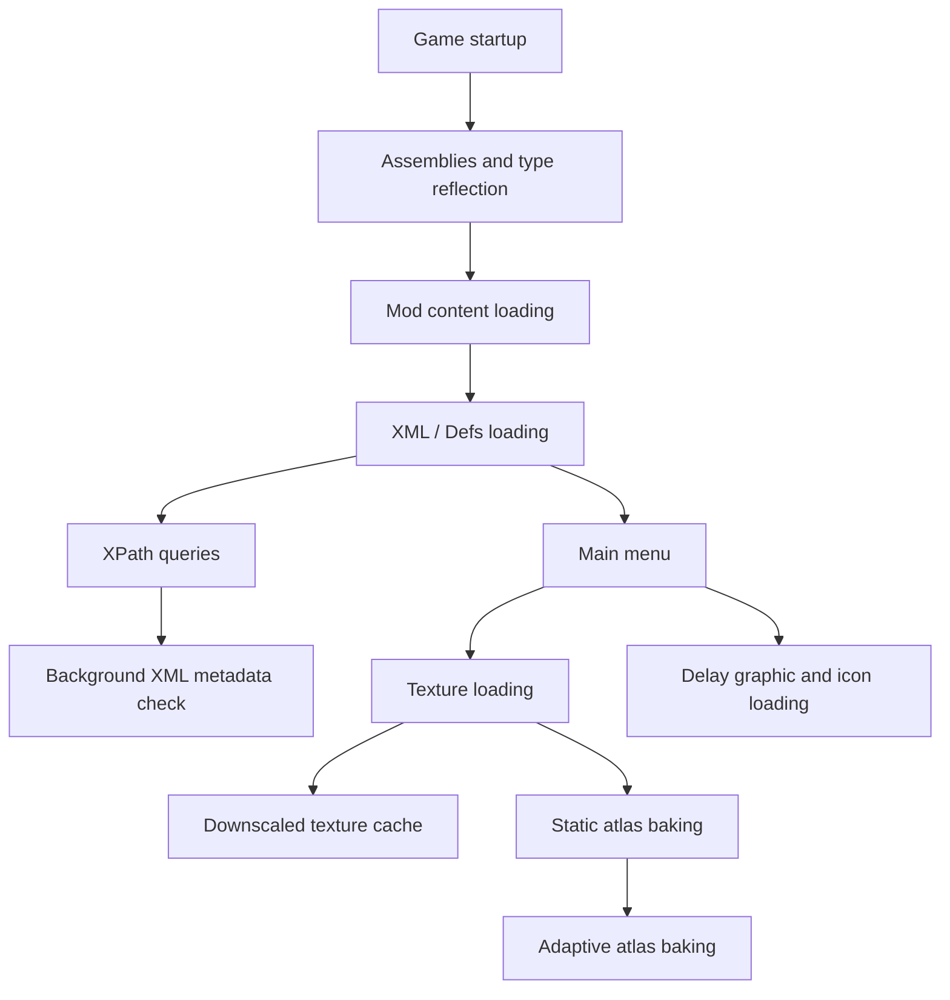

# Faster Game Loading - Continued

[](http://rimworldgame.com/)
[](LICENSE)


Makes RimWorld reach the main menu faster on large mod lists. This mod reduces startup costs from XML loading, reflection, textures, and atlas work without changing gameplay or save data.

Original mod by [Taranchuk](https://github.com/Taranchuk/FasterGameLoading); this is a maintained fork with compatibility fixes and performance improvements.

## Installation

> [!IMPORTANT]
> Requires RimWorld 1.6 and [Harmony](https://github.com/pardeike/HarmonyRimWorld/releases/latest). Load this mod after Harmony.

- **Steam Workshop**: subscribe on the [Workshop page](https://steamcommunity.com/sharedfiles/filedetails/?id=3652938473).
- **Manual**: download or clone this repository into your `RimWorld/Mods/` folder, then enable **Faster Game Loading - Continued** in the in-game mod list.

All options live in `Options → Mod options → Faster Game Loading - Continued`. Most players can keep the defaults; see [Recommended Settings](#recommended-settings).

## Startup Flow



## Features

Enabled by default:

- **Load mod content early**: Processes pending mod content and type reflection during idle loading gaps before RimWorld's normal `ReloadContentInt` pass reaches those mods.
- **Multi-threaded preloading**: Loads XML assets in parallel while preserving RimWorld's original load-folder override order.
- **XPath caching**: Caches only XML queries that never matched in the observed startup session. Metadata validation scans Mod `Defs` and `Patches` in the background; its result is committed on the Unity main thread before persisted misses are used. Persisted misses are trusted only after a scan actually commits a baseline; a scan that fails or never starts clears the persisted misses and falls back to RimWorld's original lookup. The cache is disabled after startup so runtime XML queries always use RimWorld's original lookup.

Disabled by default:

- **Delay graphic and icon loading**: Moves some non-essential visual and icon work to batched processing after entering the game.
- **Adaptive atlas baking**: Batches static atlas work based on hardware behavior and avoids known risky race/multi-mask textures.
- **Verbose logging**: Prints debugging messages.

Manual tool:

- **Downscale textures**: Downscales high-resolution textures into a separate cache. Original mod files are never modified. If you already use Graphics Settings+ or RimSort Optimize Texture, you usually do not need this.
- **Clear texture cache**: Removes cached downscaled textures so original textures are used on the next startup.

> [!NOTE]
> Brief startup unresponsiveness can be normal, especially with large mod lists. Startup sound playback is temporarily held until deferred sound definitions finish resolving, then released automatically.
> XPath caching may rebuild after the first launch, mod updates, or XML edits.
> XPath caching applies only while RimWorld is starting; it does not intercept XML queries at the main menu or during gameplay.
> Mod `Defs` and `Patches` XML edits are detected when file path, size, or modified time changes; Mod settings XML is ignored.
> **Delay graphic and icon loading** is an advanced option. If you see texture or icon timing issues, disable it first.
> Downscaled texture cache can be cleared from the mod settings.

## Compatibility

Compatibility handling exists for:

- [Loading Progress](https://github.com/ilyvion/LoadingProgress)
- [Missile Girl - Performance Mod](https://github.com/ViralReaction/MissileGirl)
- [Graphics Settings+](https://github.com/RealTelefonmast/GraphicsSetter)
- [HugsLib](https://github.com/UnlimitedHugs/RimworldHugsLib)
- [XmlExtensions](https://github.com/15adhami/XmlExtensions)
- [AyaTweaks](https://gitlab.com/WRelicK/AyaTweaks2.0) / Ayameduki mods
- [Humanoid Alien Races](https://github.com/erdelf/AlienRaces)
- [Ancot Library](https://steamcommunity.com/sharedfiles/filedetails/?id=2988801276)
- [ChezhouLib](https://steamcommunity.com/sharedfiles/filedetails/?id=3595247479)

Important behavior:

- When Missile Girl is active, XPath caching and background XML change scanning are disabled to avoid conflicting with its cache system.
- [DefLoadCache](https://github.com/FluxxField/rimworld-defload-cache) has no dedicated compatibility code in this mod. It is expected to work alongside Faster Game Loading, but use either Missile Girl or DefLoadCache, not both.
- [Image Opt](https://steamcommunity.com/sharedfiles/filedetails/?id=3543873568) compatibility is no longer maintained. When Faster Game Loading and Image Opt are enabled together, mods that depend on [Ancot Library](https://steamcommunity.com/sharedfiles/filedetails/?id=2988801276) may encounter graphical loading errors, missing textures, or black textures under some loading conditions. Using both mods together is not recommended.
- Existing Image Opt safeguards, such as downscaled-texture bypass and invalid `.dds` / `.dds.zstd` cache cleanup, do not guarantee compatibility.
- HAR and Ancot-related race mods skip some early-loading and atlas-baking paths to reduce bodyAddon, hair, ear, and multi-mask texture issues.

## Recommended Settings

Most players should start with the defaults.

If loading is still slow:

1. Keep **Load mod content early**, **Multi-threaded preloading**, and **XPath caching** enabled.
2. For large texture-heavy mod lists, prefer Graphics Settings+ or RimSort Optimize Texture. Image Opt compatibility is no longer maintained.
3. If you do not use an external texture tool, consider FGL's **Downscale textures** tool.
4. Enable **Delay graphic and icon loading** or **Adaptive atlas baking** only if you are willing to troubleshoot compatibility issues.

## Project Structure

```text
FasterGameLoading/
├── About/                         # Mod metadata, preview, and Workshop id
├── Assemblies/                    # Compiled DLL
├── LanguageData/                  # Translation XML files (EN, zh-TW, zh-CN, RU)
├── SteamDescriptions/             # Steam Workshop description sources
├── Source/
│   ├── Core/                      # Mod entry point and startup cleanup
│   ├── Settings/                  # Settings and cross-session cache data
│   ├── XMLLoadingCache/           # XML loading and XPath caching
│   ├── EarlyModContentLoading/    # Load mod content early and reflection cache
│   ├── TextureDownscaler/         # Downscale textures and cache loading
│   ├── AdaptiveAtlasBaking/       # Adaptive atlas baking
│   ├── DelayGraphicAndIconLoading/# Delay graphic and icon loading
│   ├── DelaySoundLoading/         # Deferred sound resolution
│   ├── Compatibility/             # Third-party mod compatibility handling
│   ├── Language/                  # In-game translation injection
│   ├── Utilities/                 # Shared helpers
│   └── FasterGameLoading.Tests/   # NUnit tests
├── LICENSE
└── README.md
```

## Building from Source

The main project targets .NET Framework 4.7.2 and references RimWorld via the [Krafs.Rimworld.Ref](https://www.nuget.org/packages/Krafs.Rimworld.Ref) NuGet package, so no local RimWorld installation is needed to compile. The compiled DLL is written to `Assemblies/`.

```bash
dotnet build Source/FasterGameLoading.csproj -c Release
```

Tests use NUnit on .NET 9:

```bash
dotnet test Source/FasterGameLoading.Tests/FasterGameLoading.Tests.csproj --settings test.runsettings
```

## Credits and License

Original mod by [Taranchuk](https://github.com/Taranchuk/FasterGameLoading). This fork is maintained by [mushroomTW](https://github.com/mushroomTW/FasterGameLoading---Continued) with compatibility fixes and performance improvements.

Licensed under the [MIT License](LICENSE).
